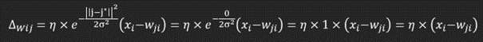
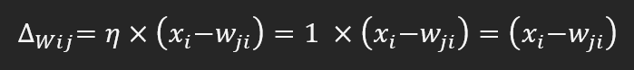

**GHAZEL Hassen et HALVICK Thomas**

# 3 Etude “théorique” de cas simples (6.5 points) 

## 3.1 Influence de η

Or il est dit que 

### Dans le cas où η = 0 quelle sera la prochaine valeur des poids du neurone gagnant ?

Si η = 0, alors nous avons :

Selon la formule ci-dessus, si η = 0, alors ∆wji = 0 : le poids du neurone gagnant n'est donc pas mis à jour.
Par conséquent, la prochaine valeur des poids sera simplement égale à leur valeur courante.

### Même question dans le cas où η = 1.

Dans le cas où η = 1, la mise à jour des poids pour le neurone gagnant est maximale. 
De ce fait, la prochaine valeur pour le neurone gagnant sera égale à sa valeur actuelle, additionnée à la différence entre l'entrée et les poids actuels du neurone gagnant.
Or, la partie de la formule générale ci-dessus nous donne 

*Donc nous avons :* 

### Dans le cas où η ∈]0, 1[ (paramétrisation “normale”) où se situera le nouveau poids par rapport à W∗ et X en fonction de η (formule mathématique simple ou explication géométrique) ?

Si η est compris entre 0 et 1, le nouveau poids sera situé sur la droite reliant le poids courant W(t) et la valeur d'entrée X.
Le nouveau poids W(t+1) sera donné par :
`W(t+1) = W(t) + η(X-W(t))`

Le déplacement le long de cette droite diffère donc selon la valeur de η :
Plus η est petit, plus le déplacement est faible, et plus le nouveau poids sera proche de W(t), mais plus η est grand, plus le déplacement sera important, et plus le nouveau poids s'éloignera de W(t) pour aller vers la valeur d'entrée.

Le déplacement le long de cette droite diffère donc selon la valeur de η :
Plus η est petit, plus le déplacement est faible, et plus le nouveau poids sera proche de W(t), mais plus η est grand, plus le déplacement sera important, et plus le nouveau poids s'éloignera de W(t) pour aller vers la valeur d'entrée.

### Que va-t-il se passer si η > 1 ?

Si η > 1, le taux d'apprentissage sera très élevé, et le nouveau poids sera situé au-delà de X par rapport à W∗.
De ce fait, l'ajustement du poids sera amplifié, ce qui signifie que le poids se déplacera plus rapidement vers la position de X.

Cela va en général conduire à une convergence plus rapide du réseau, avec également des risques d'instabilités si les poids oscillent trop fortement autour de la position optimale.

## 3.2 Influence de σ

### Si σ augmente, les neurones proches du neurone gagnant (dans la carte), vont-ils plus ou moins apprendre l’entrée courante ?

Si σ augmente, la formule ci-dessus va donc tendre vers 1. De ce fait, l'augmentation de σ va permettre de se rapprocher de plus en plus de la valeur d'entrée et de l'apprendre davantage.

### Si σ est plus grand, à convergence, l’auto-organisation obtenue sera-t-elle donc plus “resserrée” (i.e. une distance plus faible entre les poids des neurones proches) ou plus “lâche” ?

Si σ est plus grand, à convergence, l'auto-organisation obtenue sera plutôt resserrée.
Les points convergeant vers un seul et même poids, ils vont donc devenir de plus en plus proches, de plus en plus "serrés".

### Quelle mesure (formule mathématique qui sera à implémenter dans la section 4) pourrait quantifier ce phénomène et donc mesurer l’influence de σ sur le comportement de l’algorithme ?

Pour quantifier ce phénomène, il serait possible d'utiliser la variance des poids des neurones voisins.
La variance étant un outil de mesure de la dispersion des données, elle est tout à fait adaptée à la quantification de l'effet "resserré" ou "lâche" de l'auto-organisation des neurones.
Ainsi, plus σ est grand, plus la variance des poids sera faible, étant donné que les neurones seront davantage "resserrés" entre eux.

Cette mesure est donnée par la formule ci-dessous :

avec `wi` le poids du neurone i et `w barre` la moyenne des poids des neurones.

Il est également possible d'appliquer la formule suivante : 

## 3.3 Influence de la distribution d’entrée

Prenons le cas très simple d’une carte à 1 neurone qui reçoit deux entrées X1 et X2.

### Si X1 et X2 sont présentés autant de fois, vers quelle valeur convergera le vecteur du poids du neurone (en supposant un η faible - pour ne pas avoir à tenir compte de l’ordre de présentation des entrées - et suffisamment de pr´esentations - pour négliger l’influence de l’initialisation des poids) ?

Dans le cas d'une carte à 1 neurone, le neurone traité sera toujours le neurone gagnant. Dans ce cas simple, la valeur du poids du neurone va converger vers la moyenne pondérée des valeurs d'entrée, c'est-à-dire ici `(X1 + X2) / 2`.

##### Processus de convergence
- **Taux d'apprentissage faible (η faible) :** Permet des ajustements progressifs des poids, favorisant une convergence stable.
- **Répétition des présentations des entrées :** Nécessaire pour négliger l'effet de l'initialisation des poids et assurer la convergence vers une valeur stable.

##### Explication
- La mise à jour du poids du neurone est proportionnelle à la différence entre l'entrée courante et le poids actuel.
- Si X1 et X2 sont présentés autant de fois, le poids du neurone se situera à équidistance entre les deux valeurs, soit `(X1 + X2) / 2`.

##### Remarque
L'ordre de présentation des entrées peut influencer la vitesse de convergence et la stabilité de l'apprentissage, mais avec un η faible, cet effet est atténué.

En résumé, avec un η faible et une répétition suffisante des présentations des données, les poids du neurone convergeront vers la moyenne pondérée des valeurs d'entrée, indépendamment de l'ordre de présentation des données.

### Même question si X1 est présenté n fois plus que X2.

Si X1 est présenté n fois de plus que X2, la convergence du vecteur de poids du neurone sera davantage influencée par X1 que par X2. 
De ce fait, le poids du neurone se rapprochera plus de la valeur de X1 que de X2. 

Le poids final restant une moyenne pondérée des valeurs de X1 et X2, le poids de X1 sera simplement n fois supérieur à celui de X2 et aura donc une plus grande importance dans la formule.

### Même question dans le cas d’entrées provenant d’une base de données quelconque. 

??????????????????????????????????????

### Reconsidérons maintenant le cas d’une carte avec plusieurs neurones en se focalisant sur un neurone quelconque. Quels exemples apprend ce neurone et avec quelle “force” ?

??????????????????????????????????????

### En déduire comment vont se répartir les neurones d’une carte à plusieurs neurones recevant des données d’une base d’apprentissage en fonction de la densité des données. Pour rappel, la mesure de quantification vectorielle permet de mesurer ce phénomène.

??????????????????????????????????????

